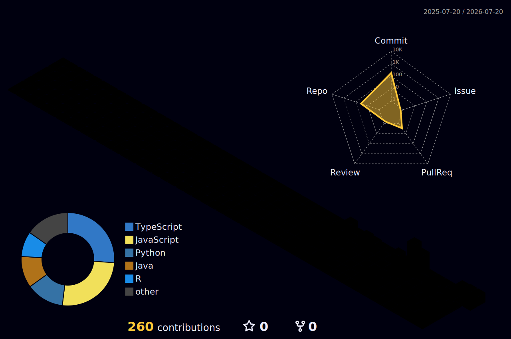

<div align="center">



<br>


<br>

<a href="https://i59.vercel.app/">
  
</a>

<a href="https://github.com/indudhara59?tab=repositories">
  
</a>

<br><br>


</div>

---

<table>
<tr>
<td width="55%" valign="top">

## 🛰️ Captain Identity

```yaml
captain:
  name: Indudhara Swamy Vivekananda
  username: indudhara59
  base: Germany

role:
  primary: AI and Machine Learning Developer
  secondary: Full-Stack Software Engineer

mission:
  - Build intelligent applications
  - Explore software architecture
  - Create healthcare technology
  - Develop autonomous agents
  - Visualize complex systems
```

</td>

<td width="45%" valign="top">

## ⚡ Ship Systems

```text
AI ENGINE             ████████████████░░  88%
FULL-STACK CORE       █████████████████░  92%
ML NAVIGATION         ████████████████░░  86%
ARCHITECTURE RADAR    ███████████████░░░  80%
DEBUGGING SHIELD      ██████████████████  98%
COFFEE REACTOR        ██████████████████  100%
```

</td>
</tr>
</table>

---

# 🌌 Select a Planet

<div align="center">

| Planet | Environment | Mission |
|:---:|:---|:---|
| 🩺 **MediCheck Prime** | Healthcare AI | Build explainable and safety-focused symptom assessment |
| 🧠 **DSARP Nexus** | Software architecture | Rank transformer-assisted refactoring strategies |
| 🤖 **Tamagotchi-9** | Autonomous agents | Simulate intelligent creatures with evolving needs |
| ✅ **DoIt Station** | Productivity | Transform tasks into a visual interactive experience |
| 🔗 **Java Core** | Static analysis | Discover hidden class and method dependencies |
| 💓 **Bio-Pulse** | Digital health | Explore autonomous preventive health monitoring |

</div>

---

<table>
<tr>
<td width="50%" valign="top">

## 🩺 MediCheck Prime


### Planet objective

Create a professional virtual health-checkup experience with supervised machine learning, emergency detection, explainable results and clinician review.

### Technology modules

`Next.js` · `TypeScript` · `Python` · `MongoDB` · `Machine Learning`

<br>

<a href="https://github.com/indudhara59/medicheck-ai">
  
</a>

</td>

<td width="50%" valign="top">

## 🧠 DSARP Nexus


### Planet objective

Generate and rank architecture-refactoring recommendations using software metrics, transformer models, learning-to-rank and grounded LLM validation.

### Technology modules

`Python` · `Transformers` · `LambdaMART` · `HPC` · `LLMs`

<br>

<a href="https://github.com/indudhara59/dsarp-transformer-refactoring-Public">
  
</a>

</td>
</tr>

<tr>
<td width="50%" valign="top">

## 🤖 Tamagotchi-9


### Planet objective

Create a persistent digital ecosystem populated by autonomous creatures that move, interact and make decisions based on their needs.

### Technology modules

`Artificial Intelligence` · `Agent Simulation` · `Web Development`

<br>

<a href="https://github.com/indudhara59/Autonomous-Digital-Tamagotchi-">
  
</a>

</td>

<td width="50%" valign="top">

## ✅ DoIt Station


### Planet objective

Build a polished multi-user productivity system with animated interactions, categories, deadlines and visual analytics.

### Technology modules

`React` · `TypeScript` · `Supabase` · `Framer Motion` · `Recharts`

<br>

<a href="https://github.com/indudhara59/Todo-List">
  
</a>

<a href="https://itodo-list.vercel.app/">
  
</a>

</td>
</tr>

<tr>
<td width="50%" valign="top">

## 🔗 Java Core


### Planet objective

Analyze Java source code and expose relationships among classes, methods and dependencies.

### Technology modules

`Java` · `Static Analysis` · `Graph Generation`

<br>

<a href="https://github.com/indudhara59/java-dependency-analyzer">
  
</a>

</td>

<td width="50%" valign="top">

## 💓 Bio-Pulse


### Planet objective

Explore a preventive health guardian using telemetry, digital-twin concepts and autonomous care coordination.

### Technology modules

`Health Technology` · `Telemetry` · `Digital Twins` · `AI`

<br>

<a href="https://github.com/indudhara59/Bio-Pulse-Autonomous-Health-Guardian">
  
</a>

</td>
</tr>
</table>

---

# 📡 Incoming Alien Transmission

<details>
<summary><b>Decode the mysterious transmission</b></summary>

<br>

```text
01010100 01101000 01100101
00100000 01100010 01110101
01100111 00100000 01101001
01110011 00100000 01101110
01100101 01100001 01110010
```

The ship detects an unknown production error.

```text
ERROR:
Cannot read properties of undefined

SHIP HEALTH  : 100%
ALIEN SHIELD : 100%
```

Choose your response.

<details>
<summary>💥 Fire random code modifications</summary>

## Mission failed

The alien shield absorbs the changes and becomes stronger.

```text
SHIP HEALTH  : 10%
ALIEN SHIELD : 140%
NEW BUGS     : 7
```

</details>

<details>
<summary>📢 Activate 500 console logs</summary>

## Signal interference detected

You discovered that something is undefined.

You also created 500 competing transmissions.

```text
SHIP HEALTH  : 55%
ALIEN SHIELD : 75%
CONSOLE LOGS : 500
```

</details>

<details>
<summary>🧪 Reproduce the error and launch a regression test</summary>

# 🏆 Transmission decoded

The missing object is detected, safely handled and protected with a test.

```text
SHIP HEALTH       : 100%
ALIEN SHIELD      : 0%
EXPERIENCE GAINED : +1000
ITEM ACQUIRED     : Quantum Regression Test
RANK UNLOCKED     : Production Guardian
```

</details>

</details>

---

# 🏙️ Contribution Megacity

<div align="center">



```text
Every contribution constructs another building in the megacity.
```

</div>

---

# 🐍 Cosmic Contribution Creature

<div align="center">

<picture>
  <source
    media="(prefers-color-scheme: dark)"
    srcset="https://raw.githubusercontent.com/indudhara59/indudhara59/output/github-contribution-grid-snake-dark.svg"
  />

  <source
    media="(prefers-color-scheme: light)"
    srcset="https://raw.githubusercontent.com/indudhara59/indudhara59/output/github-contribution-grid-snake.svg"
  />

  
</picture>

</div>

---

# 📊 Spacecraft Telemetry

<div align="center">


<br>


</div>

---

# 📈 Flight Path

<div align="center">


</div>

---

# 🏅 Galactic Achievements

<div align="center">


</div>

---

# 🧬 DNA of the Developer

<div align="center">


</div>

---

# 🗃️ Captain's Log

```text
STARDATE 01  Building explainable AI systems
STARDATE 02  Exploring transformer-assisted refactoring
STARDATE 03  Developing interactive TypeScript applications
STARDATE 04  Studying program analysis and software architecture
STARDATE 05  Prototyping intelligent healthcare technology
STARDATE 06  Creating visual machine-learning experiences
```

---

<details>
<summary><b>🛸 Enter the restricted area</b></summary>

<br>

<div align="center">

# 👽 Secret Life Form Discovered

```text
SPECIES          : Curious Developer
INTELLIGENCE     : Extremely High
FAVOURITE TOOL   : Curiosity
BONUS ENERGY     : +59
SECRET MESSAGE   : The universe rewards developers who explore.
```

</div>

</details>

---

<div align="center">

## Establish Communication

<a href="https://i59.vercel.app/">
  
</a>

<a href="https://github.com/indudhara59">
  
</a>

<br><br>

```text
╔══════════════════════════════════════════════════════════════╗
║  STAR A PROJECT       → SEND ONE ENERGY CRYSTAL             ║
║  FOLLOW THE CAPTAIN   → JOIN THE SPACE CREW                 ║
║  RETURN LATER         → DISCOVER NEW PLANETS                ║
╚══════════════════════════════════════════════════════════════╝
```

### `Transmission complete. Safe travels, explorer.`

</div>
